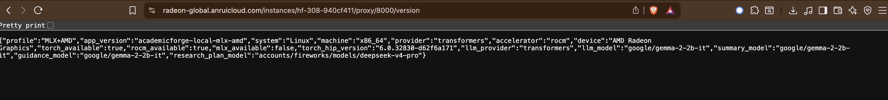

# AcademicForge

AcademicForge is a hackathon research-to-implementation assistant. It searches live academic sources, ranks papers with hybrid retrieval, lets the user choose evidence, and generates concise summaries, paper guidance, and a structured Research Plan.

The current repo is optimized for two local demo paths:

- **AMD/ROCm VM:** Gemma 2B through Hugging Face Transformers on ROCm for Fast Mode, with BGE retrieval models on GPU by default.
- **Apple Silicon:** the closest MLX-compatible Gemma model for local Fast Mode.

When a `FIREWORKS_API_KEY` is present, Research Plan generation uses Fireworks DeepSeek for higher-quality synthesis. If the key is absent, Research Plan falls back to local Gemma.

## Current Stack

| Area | Current implementation |
| :--- | :--- |
| Frontend | Streamlit |
| Backend | FastAPI + Uvicorn |
| Live sources | arXiv and Semantic Scholar |
| Retrieval | BM25 lexical search + BGE dense embeddings + Reciprocal Rank Fusion |
| Reranking | `BAAI/bge-reranker-base` cross-encoder |
| Fast local model | `google/gemma-2-2b-it` on AMD/ROCm, `mlx-community/gemma-2-2b-it-4bit` on Apple Silicon |
| Research Plan model | `accounts/fireworks/models/deepseek-v4-pro` when `FIREWORKS_API_KEY` is set |

## Execution Flow

```text
User question
  -> arXiv + Semantic Scholar retrieval
  -> BM25 lexical rank
  -> BGE dense vector rank
  -> Reciprocal Rank Fusion
  -> BGE cross-encoder rerank
  -> user selects evidence papers
  -> local Gemma summaries
  -> Research Plan prompt assembly
  -> Fireworks DeepSeek if key exists, otherwise local Gemma
  -> Streamlit renders streamed output
```

## Quick Start

```bash
git clone https://github.com/shreyshrivastava/AcademicForge.git
cd AcademicForge

python3 -m venv venv
source venv/bin/activate

python -m pip install --upgrade pip setuptools wheel
python -m pip install --ignore-installed blinker -r requirements-local.txt

cp .env.example .env
```

Edit `.env` and add your real keys. The placeholders in `.env.example` are comments only, so copying the file will not accidentally enable cloud generation.

Start both backend and frontend:

```bash
./start.sh
```

Open the app locally:

```text
http://127.0.0.1:8501
```

Check backend diagnostics:

```bash
curl http://127.0.0.1:8000/version
```

On AMD ROCm, the diagnostics should show `"accelerator":"rocm"`. Retrieval uses the PyTorch device name `"cuda"` even on ROCm, so `"retrieval_device":"cuda"` means the BGE retrieval models are on the AMD GPU through PyTorch/ROCm.

## Hosted Demo

Live demo: [academicforge-demo.streamlit.app](https://academicforge-demo.streamlit.app/)

The hosted Streamlit Cloud version is a lightweight preview of AcademicForge,
not the full hackathon build. It keeps the original Streamlit interface from
the main app, but routes actions through a cloud-safe demo runtime so the public
URL can show the research-planning flow without requiring local GPUs, model
downloads, Fireworks credits, or a running FastAPI backend.

The demo intentionally uses a separate Streamlit entry point that launches the
same UI with cloud-safe settings:

```text
frontend/streamlit_cloud_app.py
```

This public version uses the original UI layout, live academic search, ranked
paper cards, Research Lens selection, retrieval diagnostics, selectable
evidence, downloadable Markdown plans, and lightweight Summary, Guidance, and
Research Plan panels. The Summary and Guidance panels are evidence-based
previews derived from paper titles, abstracts, sources, and ranking metadata.

The hosted demo does not run the local MLX/ROCm compute path, FastAPI backend,
or production model/API configuration. The complete model-backed experience is
available when running the project locally from this repository.

To protect usage and avoid unintended API spend, the hosted demo:

- does not call paid LLM APIs by default;
- does not use the full local model compute path;
- limits each IP address to one cloud analysis using a salted hash;
- stores usage counts without storing raw IP addresses;
- falls back to lightweight demo data when public academic-source APIs are
  unavailable.

For the best and complete experience, run the full application locally using the
setup instructions below. The local path is the intended version for the full
hackathon workflow, including FastAPI, Streamlit, hybrid retrieval, reranking,
local MLX/ROCm generation, and optional Fireworks-based synthesis.

Small Gemma-family models can be enabled only in environments that can satisfy
the required Hugging Face access, model download, and compute requirements. They
are intentionally not enabled by default in the hosted demo so the public app
remains stable and inexpensive to run.

See `docs/streamlit_cloud.md` for Streamlit Cloud deployment settings and
optional Fireworks controls.

## AMD VM Setup

On the Radeon VM used during testing:

```bash
cd /workspace
git -c http.sslVerify=false clone https://github.com/shreyshrivastava/AcademicForge.git
cd AcademicForge

python3 -m venv venv
source venv/bin/activate

python -m pip install --upgrade pip setuptools wheel
python -m pip install --ignore-installed blinker -r requirements-local.txt

cp .env.example .env
```

Set real keys in `.env`, then run:

```bash
pkill -f streamlit || true
pkill -f uvicorn || true
./start.sh
```

Open Streamlit through the notebook proxy:

```text
https://radeon-global.anruicloud.com/instances/<instance-id>/proxy/8501/
```

Check backend:

```text
https://radeon-global.anruicloud.com/instances/<instance-id>/proxy/8000/version
```

Do not use old `/spaces/...` URLs or `VERCEL_API_URL`; those paths are not part of the current app.

## Environment Variables

| Variable | Default | Purpose |
| :--- | :--- | :--- |
| `HF_TOKEN` | unset | Hugging Face token for gated/local model downloads. |
| `FIREWORKS_API_KEY` | unset | Enables Fireworks DeepSeek Research Plan generation. |
| `LOCAL_LLM_PROVIDER` | `auto` | Auto-selects MLX on Apple Silicon, Transformers elsewhere. |
| `LOCAL_LLM_MODEL` | platform default | Fast Mode local model. |
| `LOCAL_LLM_DEEP_MODEL` | Fireworks DeepSeek when key exists, otherwise local model | Deep Mode model. |
| `LOCAL_LLM_RESEARCH_PLAN_MODEL` | same as deep model | Research Plan model. |
| `LOCAL_LLM_MAX_TOKENS` | `2500` | Default generation token budget. |
| `LOCAL_LLM_TEMPERATURE` | `0.2` | Local generation temperature. |
| `ACADEMICFORGE_BACKEND_URL` | `http://127.0.0.1:8000` | Backend URL used by Streamlit. |
| `ACADEMICFORGE_RETRIEVAL_DEVICE` | `auto` | Override retrieval device, for example `cpu` if GPU memory is tight. |
| `ACADEMICFORGE_PRELOAD_WEIGHTS` | `true` | Pre-download and warm local/retrieval weights before serving. |

## API Endpoints

| Endpoint | Purpose |
| :--- | :--- |
| `GET /health` | Backend readiness and model warmup state. |
| `GET /version` | Runtime, accelerator, provider, model, and retrieval device diagnostics. |
| `GET /config` | Public model routing and generation mode configuration. |
| `POST /search` | Live paper search and hybrid retrieval. |
| `POST /summarize` | Local paper summary generation. |
| `POST /paper-guidance` | Practical guidance for one selected paper. |
| `POST /research-plan` | Non-streaming Research Plan generation. |
| `POST /research-plan/stream` | Streaming Research Plan generation. |

There are no cache-status endpoints in the current code path.

## Demo Query

A good short demo query:

```text
Reducing hallucinations in retrieval augmented generation
```

For an AMD-focused demo:

```text
How do I optimize FlashAttention on AMD MI300?
```

## Tests

After dependencies are installed:

```bash
python -m py_compile backend/*.py backend/retrieval/*.py frontend/*.py scripts/*.py tests/*.py
python tests/test_generation_pipeline.py
python tests/test_llm_routing.py
python tests/test_retrieval_device.py
python tests/test_api_contract.py
python tests/test_retrieval.py
```

## Screenshots And Proof

### ROCm Runtime Proof



The `/version` endpoint shows the app running on Linux with the Transformers backend, ROCm acceleration enabled, and an AMD Radeon device detected.

### Additional Demo Proof To Capture

- Search results with BM25, dense, RRF, and categories.
- Summary output.
- Guidance output.
- Research Plan output.

## Repository Layout

```text
backend/                  FastAPI app, model routing, generation, retrieval
backend/retrieval/        BM25, dense retrieval, RRF, reranker, device selection
frontend/                 Streamlit UI
scripts/download_weights.py  Local/retrieval weight preload helper
tests/                    API, routing, generation, retrieval tests
docs/                     Setup and architecture notes
start.sh                  Starts backend and frontend together
```
