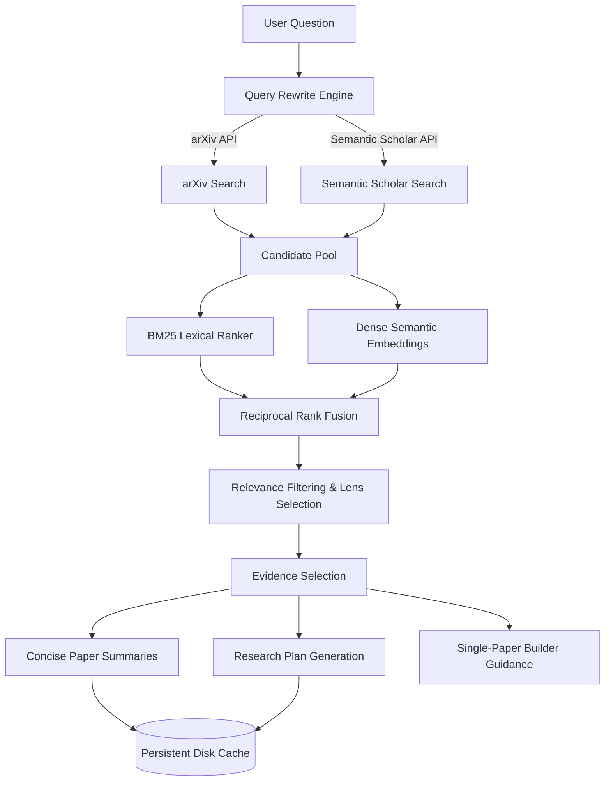

# AcademicForge

AcademicForge is a local-first, AI-powered research-to-implementation engine that translates academic papers into production-ready system architectures and engineering blueprints.

Designed for the **AMD Developer Hackathon (Track 3: Unicorn Track)**, AcademicForge acts as an explainable, self-hosted research copilot. It combines hybrid document retrieval, Reciprocal Rank Fusion (RRF), local vector embeddings, and streamed local LLM inference to compile multiple research papers into structured **Research Plans** and **Builder Guidance**.

---

## 🚀 Hero Section

### Tech Stack
*   **Backend:** FastAPI, Uvicorn, Python 3.11+
*   **Frontend:** Streamlit
*   **Retrieval:** BM25 (Rank-BM25), Dense Vector Embeddings (`BAAI/bge-small-en-v1.5`), Reciprocal Rank Fusion (RRF)
*   **Inference Backends:** 
    *   `mlx` (Native Apple Silicon acceleration via `mlx-lm`)
    *   `transformers` (PyTorch backend supporting **AMD ROCm** and NVIDIA CUDA architectures)
*   **Default Models:** `mlx-community/Qwen3-4B-4bit` (Fast Mode), `mlx-community/gemma-4-e2b-it-OptiQ-4bit` (Deep Mode)

---

## 📋 Problem Statement

Research-minded developers, engineers, and startup founders face three primary friction points when dealing with scientific literature:

1.  **Information Overload:** A simple search on arXiv yields hundreds of pages. Sorting through abstracts, introduction chapters, and mathematical notation is incredibly slow.
2.  **Fragmented Workflows:** Builders must jump between academic databases, PDF viewers, search engines, and generic chat inputs to collect ideas, compare models, and translate them into code.
3.  **The Jargon-to-Code Gap:** Academic papers are optimized for publication metrics, not execution. Converting a theoretical mathematical formula into a database schema, component list, or system architecture is a highly manual, error-prone translation task.

---

## 💡 The Solution: A Research-to-Implementation Copilot

AcademicForge is not a generic conversation bot; it is a developer-centric RAG pipeline designed to automate the research-to-build workflow:

```text
Scientific Literature (arXiv & Semantic Scholar)
  ──[Hybrid Retrieval & RRF Fusion]──>
    Curated Evidence Set & Explanable Ranks
      ──[Local LLM Pipeline Routing]──>
        Structured, Actionable Research & Build Plans
```

It fetches candidate papers live, merges their rankings, filters out weak associations, allows the user to select the exact evidence to ground the synthesis, and generates a structured, streamable **Research Plan** and **Builder Guidance** tailored directly for code implementation.

---

## 🤖 Why Not Just Use ChatGPT Deep Research?

While ChatGPT is an excellent generalist search agent, AcademicForge offers significant engineering and workflow advantages for developer applications:

| Feature | AcademicForge | ChatGPT Deep Research |
| :--- | :--- | :--- |
| **Explainable Retrieval** | Explicitly displays BM25 lexical rank, dense semantic rank, and Reciprocal Rank Fusion (RRF) scores in the UI. | Black box search selection with no rank transparency. |
| **Strict Context Grounding** | Prompts are injected *only* with retrieved paper metadata and summary abstracts. No hallucinated citations. | Relies on web crawls and parametric memory, which frequently invent paper details. |
| **Data Privacy & IP Control** | Can run 100% locally on your own hardware (AMD ROCm / Apple Silicon). No corporate code or unpublished ideas leave your machine. | Requires uploading proprietary concepts and queries to third-party OpenAI endpoints. |
| **Local Cache Performance** | Multi-tiered disk and memory caching ensures repeat queries or identical evidence runs load instantly. | Re-runs search queries and synthesis scripts from scratch, costing time and API limits. |
| **Targeted Engineering Output** | Structured specifically to output project names, component architectures, difficulty levels, and tradeoffs. | Outputs generic literature reviews or academic summaries. |

---

## ✨ Features

*   **Multi-Source Candidate Search:** Live query ingestion fetching candidate matches from both **arXiv** and **Semantic Scholar**.
*   **Query Rewrite Engine:** Preprocesses casual user input into academic-friendly keywords.
*   **Dual-Engine Hybrid Retrieval:** Lexical matching (BM25) combined with dense vector semantic search (`BAAI/bge-small-en-v1.5` embeddings).
*   **Reciprocal Rank Fusion (RRF):** Merges rank lists mathematically to prevent score-distribution bias.
*   **Structured Research Lenses:** Dynamic candidate weighting (Balanced, Foundational, Survey, Implementation Focused, Evaluation Focused, Alternative Approach, Contrarian View).
*   **Task-Specific Model Routing:** Routes queries to distinct models for fast summarization vs. deep research plans.
*   **Streamed Generation:** High-performance, incremental token streaming for real-time UI rendering.
*   **Multi-Tiered Local Cache:** Persistent JSON cache stores summaries and research plans locally to eliminate LLM latency.
*   **Explainable Ranks:** Cards display raw search scores and metadata chips directly.
*   **Builder Guidance:** Single-click practical guidance generated for individual papers.

---

## 📐 System Architecture

The following diagram maps the query-to-build pipeline:



---

## 🔍 Retrieval Pipeline

### 1. BM25 Lexical Ranker
Matches exact keyword overlap across titles, abstracts, categories, and tags. This ensures that specific model names, algorithms, or technical terms are surfaced accurately.

### 2. Dense Semantic Search
Uses `BAAI/bge-small-en-v1.5` (a 384-dimensional dense vector embedding model) to calculate cosine similarity. This surfaces papers that discuss similar concepts using different terminology.
*   *Fallback Behavior:* If `sentence-transformers` is not installed, the dense search module falls back to a lexical cosine-similarity vectorizer, keeping the app functional.

### 3. Reciprocal Rank Fusion (RRF)
Fuses the rankings from BM25 and Dense search using the standard formula:
$$RRF(d) = \sum_{m \in M} \frac{1}{k + r_m(d)}$$
(where $k = 60$). RRF does not require score normalization, which prevents dense search scores from dominating lexical matches.

---

## 🤖 AI Models

AcademicForge routes generation requests dynamically to optimize quality and speed:

| Model Role | Default Model | Configurable Environment Variable | Inference Backend | Description |
| :--- | :--- | :--- | :--- | :--- |
| **Fast Mode (Default)** | `mlx-community/Qwen3-4B-4bit` | `LOCAL_LLM_MODEL` | `mlx` or `transformers` | Model used for query routing, paper summarization, and quick plans in Fast Mode. |
| **Deep Mode** | `mlx-community/gemma-4-e2b-it-OptiQ-4bit` | `LOCAL_LLM_RESEARCH_PLAN_MODEL` | `mlx` or `transformers` | Used for comprehensive Research Plans, system design, and tradeoffs. |
| **Summarizer** | `mlx-community/Qwen3-4B-4bit` | `LOCAL_LLM_SUMMARY_MODEL` | `mlx` or `transformers` | Generates plain-English paper summaries. |
| **Dense Embeddings** | `BAAI/bge-small-en-v1.5` | *(Built-in)* | `transformers` (PyTorch) | Computes 384-dimensional query and abstract dense vectors. |
| **Dense Fallback** | Cosine Similarity Vectorizer | *(Automatic Fallback)* | Pure Python / `numpy` | Local cosine-similarity fallback if `sentence-transformers` is missing. |

---

## ⚙️ Backend Architecture (FastAPI)

The FastAPI server (`backend/app.py`) is structured to expose clean, stateless API contracts:

*   `GET /config` - Serves current local configurations, models, and cache paths.
*   `POST /search` - Ingests queries, calls arXiv/Semantic Scholar, merges and ranks candidates.
*   `POST /summarize` - Runs the local LLM summarization pipeline for a selected paper.
*   `POST /research-plan` - Generates a structured research plan synchronously.
*   `POST /research-plan/stream` - High-performance streaming endpoint returning plan tokens chunk-by-chunk.
*   `POST /research-plan/cache-status` - Checks if the requested query/evidence configuration is cached on disk.
*   `POST /paper-guidance` - Exposes single-paper implementation guidance.

*Note: For backwards compatibility, the legacy `/roadmap/*` routes remain active and redirect directly to the `/research-plan/*` and `/paper-guidance/*` endpoints.*

---

## 🖥️ Frontend (Streamlit)

The web client (`frontend/streamlit_app.py`) implements a card-based research lens dashboard:
1.  **Search Console:** Input research goals and select Category Filters (e.g., Balanced, Foundational, Implementation Focused).
2.  **Ranking Panel:** Lists cards for each paper showing its source, author list, BM25/Dense ranks, and abstract snippets.
3.  **Synthesis Controller:** Trigger summarization for papers, select specific papers to load into context, select Generation Mode (Fast or Deep), and stream the generated Research Plan directly.
4.  **Download Bundle:** Exposes a single-click Markdown export button to save the entire generated plan locally.

---

## 🔴 AMD Integration (ROCm)

AcademicForge provides full compatibility with AMD GPU platforms through the PyTorch-based `transformers` provider:

1.  **ROCm PyTorch Integration:** By setting `LOCAL_LLM_PROVIDER=transformers`, the app switches its inference engine to PyTorch. When run inside a ROCm-capable environment, the model automatically offloads weights to AMD GPUs via `device_map="auto"`.
2.  **Model Loading Optimization:** Models are loaded using `torch_dtype="auto"` to automatically leverage FP16 or BF16 precision depending on the target AMD Instinct or Radeon GPU hardware.
3.  **In-Memory Dense Search:** Sentence-Transformers runs natively on ROCm devices for ultra-fast vector embedding generation.
4.  **Local-First MLX Mode:** On Apple Silicon development hardware, the app defaults to native MLX (`mlx-lm`) to allow fast local prototyping.

---

## 🛠️ Local Development

### 1. Setup Environment
```bash
# Clone the repository
git clone https://github.com/shreyshrivastava/AcademicForge.git
cd AcademicForge

# Create and activate virtual environment
python3 -m venv venv
source venv/bin/activate

# Install requirements
pip install -r requirements.txt
```

### 2. Optional: Install Dense Embeddings Support
```bash
pip install sentence-transformers
```

### 3. Configure Environments
Copy the example config file to initialize your settings:
```bash
cp .env.example .env
```

---

## 📋 Environment Variables

| Variable | Default | Allowed Values | Description |
| :--- | :--- | :--- | :--- |
| `LOCAL_LLM_PROVIDER` | `mlx` | `mlx`, `transformers`, `torch`, `cuda`, `rocm` | The local inference engine backend to use. |
| `LOCAL_LLM_MODEL` | `mlx-community/Qwen3-4B-4bit` | Any MLX/HuggingFace model | Default model used for general tasks and fast mode. |
| `LOCAL_LLM_SUMMARY_MODEL` | `mlx-community/Qwen3-4B-4bit` | Any MLX/HuggingFace model | Model used to generate plain-English summaries. |
| `LOCAL_LLM_RESEARCH_PLAN_MODEL`| `mlx-community/Qwen3-4B-4bit` | Any MLX/HuggingFace model | Model used for Research Plans (Deep Mode overrides this to Gemma 4). |
| `LOCAL_LLM_MAX_TOKENS` | `700` | Positive integer | The token budget limit for LLM generation. |
| `LOCAL_LLM_TEMPERATURE` | `0.2` | Float `0.0 - 1.0` | Temperature setting (lower = more deterministic). |
| `ACADEMICFORGE_CACHE_DIR` | `.academicforge_cache` | Path string | Target directory to store disk cache. |
| `ACADEMICFORGE_BACKEND_URL` | `http://localhost:8000` | URL string | The API backend URL used by the Streamlit app. |

---

## ⚡ Running the Project

### 1. Start the Backend API
```bash
source venv/bin/activate
uvicorn backend.app:app --host 127.0.0.1 --port 8000 --reload
```
Check health:
```bash
curl http://127.0.0.1:8000/config
```

### 2. Start the Streamlit Frontend
In a separate terminal window:
```bash
source venv/bin/activate
streamlit run frontend/streamlit_app.py --server.address 127.0.0.1 --server.port 8501
```
Open [http://127.0.0.1:8501](http://127.0.0.1:8501) in your browser.

### 3. Run Automated Tests
AcademicForge maintains a test suite checking local logic, cache integrity, model config, and API contracts. Run all tests with:
```bash
source venv/bin/activate
python tests/test_cache.py
python tests/test_generation_pipeline.py
python tests/test_llm_routing.py
python tests/test_api_contract.py
python tests/test_retrieval.py
```

## 📝 Demo Scripts

### Recommended Search Queries:
1.  `reduce AI hallucination` (AI Domain)
2.  `photovoltaic solar grid forecasting` (Energy Domain)
3.  `automated test suite code debugging` (Software Domain)
4.  `diet exercise calorie restriction lipid metabolism` (Health Domain)

### Standard Demo Flow:
1.  Type `reduce AI hallucination` into the search box.
2.  Review the cards: highlight how **BM25 Rank** captures exact phrases and **Dense Rank** finds conceptual matches.
3.  Select three relevant papers.
4.  Generate summaries to show local cache speed.
5.  Switch mode to **Deep Mode (Gemma)** and generate a streamed **Research Plan**. Note the structural breakdown (Core Architecture, Component details, difficulty levels).
6.  Click **Download Markdown** to show final file delivery.

---

## 📂 Repository Structure

```text
AcademicForge/
├── .academicforge_cache/    # Local JSON cache directory
├── .agents/                 # Workspace customizations (skills)
├── backend/
│   ├── retrieval/
│   │   ├── __init__.py
│   │   ├── bm25.py          # Local lexical keyword ranker
│   │   ├── dense.py         # Local dense vector retriever (BGE / cosine)
│   │   ├── hybrid.py        # Combines BM25 & dense retrievals
│   │   ├── models.py        # Retrieval data schemas
│   │   ├── reranker.py      # Cross-encoder placeholder
│   │   └── rrf.py           # Reciprocal Rank Fusion implementation
│   ├── app.py               # FastAPI backend exposing search/generation routes
│   ├── cache.py             # Memory + disk caching implementation
│   ├── config.py            # Environment-aware application configuration
│   ├── data_pipeline.py     # Main search & ranking orchestration
│   ├── llm.py               # Local-first LLM facade (MLX/Transformers)
│   ├── pdf_parser.py        # PDF parser placeholder
│   └── research_plan_generator.py # Streamed Research Plan & Guidance prompts
├── docs/
│   ├── architecture.md      # High-level architecture documentation
│   ├── repository-audit.md  # Audit notes
│   ├── roadmap.md           # Product roadmap and known limitations
│   └── setup.md             # Detailed installation and launch instructions
├── frontend/
│   └── streamlit_app.py     # Streamlit web interface
├── scripts/
│   └── run_local.py         # Multi-process orchestrator script
├── tests/
│   ├── test_api_contract.py # FastAPI contract verification tests
│   ├── test_cache.py        # Caching logic tests
│   ├── test_generation_pipeline.py # Core LLM generation flow tests
│   ├── test_llm_routing.py  # LLM model routing config tests
│   └── test_retrieval.py    # BM25/Dense/RRF verification tests
├── requirements.txt         # Package dependencies
└── README.md                # Main project description & judge guide
```

---

## 🔮 Future Roadmap

*   **Full-PDF Parsing:** Move from abstract-only metadata extraction to reading full scientific PDFs dynamically using `pypdf`.
*   **Cross-Encoder Reranking:** Enable deep post-retrieval reranking using cross-encoders (`BAAI/bge-reranker-base`) inside `backend/retrieval/reranker.py`.
*   **Multi-Paper File Upload:** Allow users to upload their own research PDFs to be ingested into the local vector space alongside live arXiv/Semantic Scholar downloads.
*   **Enterprise Document Pools:** Add support for indexing proprietary enterprise manuals, specs, or documents.
*   **Direct AMD Developer Cloud Deployment:** Provide Docker Compose files optimized for one-click template deployments on ROCm-capable virtual hosts.

---

## 📄 License
This project is licensed under the MIT License - see the `LICENSE` file for details.

---

## 🤝 Acknowledgements
*   **arXiv API** and **Semantic Scholar API** for search candidate indices.
*   **AMD Developer Hackathon** sponsors and organizers.
*   **mlx-lm** and **Hugging Face Transformers** teams for model serving utilities.
