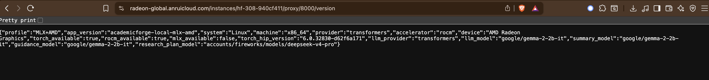

# AcademicForge

AcademicForge is a hackathon research-to-implementation assistant. It searches live academic sources, ranks papers with hybrid retrieval, lets the user choose evidence, and generates concise summaries, paper guidance, and a structured Research Plan.

The current repo is optimized for two local demo paths:

- **AMD/ROCm VM:** Gemma 2B through Hugging Face Transformers on ROCm for Fast Mode, with BGE retrieval models on GPU by default.
- **Apple Silicon:** the closest MLX-compatible Gemma model for local Fast Mode.

Fireworks DeepSeek is available as an opt-in remote mode. MLX remains the default local generation path, even when a `FIREWORKS_API_KEY` is present.

## Current Stack

| Area | Current implementation |
| :--- | :--- |
| Frontend | Streamlit |
| Backend | FastAPI + Uvicorn |
| Live sources | arXiv and Semantic Scholar |
| Retrieval | BM25 lexical search + BGE dense embeddings + Reciprocal Rank Fusion |
| Reranking | `BAAI/bge-reranker-base` cross-encoder |
| Fast local model | `google/gemma-2-2b-it` on AMD/ROCm, `mlx-community/gemma-2-2b-it-4bit` on Apple Silicon |
| Research Plan model | Local Gemma by default; Fireworks only when explicitly enabled |

## Execution Flow

```text
User question
  -> arXiv + Semantic Scholar retrieval
  -> BM25 lexical rank
  -> BGE dense vector rank
  -> Reciprocal Rank Fusion
  -> BGE cross-encoder rerank
  -> user selects evidence papers
  -> local Gemma summaries
  -> Research Plan prompt assembly
  -> local Gemma, or opt-in Fireworks DeepSeek
  -> Streamlit renders streamed output
```

## Version Comparison

The current version keeps the previous research workflow intact and adds a
portable ranking and runtime layer around it.

| Area | Previous version | Current version |
| :--- | :--- | :--- |
| Search | Hybrid BM25, dense, RRF, and cross-encoder ranking | Same ranking pipeline, with optional OpenJev final reranking in Quality Mode |
| Repeated searches | Retrieval ran again for each request | Completed searches are cached in memory for faster repeated queries |
| Local runtime | MLX on Apple Silicon, with limited portability | MLX remains the Apple default; Transformers/PyTorch supports NVIDIA CUDA and AMD ROCm |
| Summaries | Local model generation | Same summary flow and model behavior; runtime backend can change by platform |
| Guidance and Research Plan | Local model generation | Same generation flow, with the same MLX, CUDA, or ROCm backend selection |
| Deployment | Primarily local Apple or AMD demonstrations | One application path for Apple Silicon, NVIDIA cloud GPUs, and AMD cloud GPUs |

The main improvement is portability and retrieval control. The current version
does not replace the original Fast Mode ranking logic. It adds a selectable
Quality Mode and makes the local inference layer easier to run on different
GPU platforms.

## Quick Start

```bash
git clone https://github.com/shreyshrivastava/AcademicForge.git
cd AcademicForge

python3 -m venv venv
source venv/bin/activate

python -m pip install --upgrade pip setuptools wheel
python -m pip install --ignore-installed blinker -r requirements-local.txt

cp .env.example .env
```

Edit `.env` and add your real keys. The placeholders in `.env.example` are comments only, so copying the file will not accidentally enable cloud generation.

Start both backend and frontend:

```bash
./start.sh
```

Open the app locally:

```text
http://127.0.0.1:8501
```

Check backend diagnostics:

```bash
curl http://127.0.0.1:8000/version
```

On AMD ROCm, the diagnostics should show `"accelerator":"rocm"`. Retrieval uses the PyTorch device name `"cuda"` even on ROCm, so `"retrieval_device":"cuda"` means the BGE retrieval models are on the AMD GPU through PyTorch/ROCm.

## AMD VM Setup

On the Radeon VM used during testing:

```bash
cd /workspace
git -c http.sslVerify=false clone https://github.com/shreyshrivastava/AcademicForge.git
cd AcademicForge

python3 -m venv venv
source venv/bin/activate

python -m pip install --upgrade pip setuptools wheel
python -m pip install --ignore-installed blinker -r requirements-local.txt

cp .env.example .env
```

Set real keys in `.env`, then run:

```bash
pkill -f streamlit || true
pkill -f uvicorn || true
./start.sh
```

Open Streamlit through the notebook proxy:

```text
https://radeon-global.anruicloud.com/instances/<instance-id>/proxy/8501/
```

Check backend:

```text
https://radeon-global.anruicloud.com/instances/<instance-id>/proxy/8000/version
```

Do not use old `/spaces/...` URLs or `VERCEL_API_URL`; those paths are not part of the current app.

## Environment Variables

| Variable | Default | Purpose |
| :--- | :--- | :--- |
| `HF_TOKEN` | unset | Hugging Face token for gated/local model downloads. |
| `FIREWORKS_API_KEY` | unset | Credential for optional Fireworks generation. |
| `LOCAL_LLM_USE_FIREWORKS` | `false` | Explicitly enables Fireworks routing. |
| `LOCAL_LLM_PROVIDER` | `auto` | Auto-selects MLX on Apple Silicon, Transformers elsewhere. |
| `LOCAL_LLM_MODEL` | platform default | Fast Mode local model. |
| `LOCAL_LLM_DEEP_MODEL` | local model | Deep Mode model. |
| `LOCAL_LLM_RESEARCH_PLAN_MODEL` | same as deep model | Research Plan model. |
| `REMOTE_LLM_USE_FOR_DEEP` | `false` | Enables a remote Deep Mode provider when a key is configured. |
| `REMOTE_LLM_PROVIDER` | `groq` | Remote provider name. |
| `GROQ_API_KEY` | unset | API key for Groq Deep Mode. |
| `REMOTE_LLM_MODEL` | `openai/gpt-oss-120b` | Remote Deep Mode model. |
| `REMOTE_LLM_BASE_URL` | Groq OpenAI-compatible API | Remote provider endpoint. |
| `LOCAL_LLM_MAX_TOKENS` | `2500` | Default generation token budget. |
| `LOCAL_LLM_TEMPERATURE` | `0.2` | Local generation temperature. |
| `ACADEMICFORGE_SEARCH_CACHE_TTL_SECONDS` | `300` | Lifetime of a completed in-memory search result. |

### Cloud GPU Runtime

MLX remains the default on Apple Silicon. For cloud deployment, install the
platform-specific PyTorch dependencies and use the same Transformers backend:

```bash
# NVIDIA CUDA
python -m pip install -r requirements-cuda.txt

# AMD ROCm
python -m pip install -r requirements-rocm.txt

export LOCAL_LLM_PROVIDER=transformers
./start.sh
```

The backend detects CUDA and ROCm through PyTorch and reports the selected
accelerator at `GET /version`. Summary and roadmap routes do not change between
MLX, CUDA, and ROCm deployments.

### Search Modes

AcademicForge has two search modes. Both use the same local LLM settings for
summaries and roadmaps.

- **Fast mode** (default): uses the original BM25, dense, RRF, and existing
  reranker pipeline. OpenJev is disabled for the lowest latency. Completed
  searches are cached, so repeating the same query with the same filters is
  nearly immediate during the cache lifetime.
- **Quality mode**: uses the same retrieval pipeline, then OpenJev reranks the
  top results. OpenJev scores and completed searches are cached in memory for
  repeated result sets.

Fast Mode is usually the better interactive choice: it preserves the original
ranking behavior and has the lowest first-request latency. Quality Mode is
usually better when the ordering of the top papers matters more than startup
time because OpenJev adds a final semantic relevance pass. Both modes use the
same BM25, dense, RRF, and cross-encoder candidate pipeline, and both benefit
from caching on repeated searches.

Search mode does not change the summary, paper guidance, or Research Plan
prompts. Those outputs use the configured local model and runtime provider.
Therefore, switching from Fast Mode to Quality Mode improves paper ordering,
not the writing quality of generated text.

Deep generation is configured separately from search. Set
`REMOTE_LLM_USE_FOR_DEEP=true` and provide `GROQ_API_KEY` to use Groq
`openai/gpt-oss-120b` for Deep summaries, guidance, and roadmaps. Fast mode and
the local fallback continue using the existing MLX model.

To use the original fast path:

```bash
export ACADEMICFORGE_SEARCH_MODE=fast
export JEV_ENABLED=false
./start.sh
```

### Optional Local OpenJev Quality Mode

OpenJev can be enabled as an optional final search reranker. BM25, dense search,
and RRF still retrieve the candidate pool; OpenJev scores the top results for
query relevance and places the most relevant papers first. It also adds
relevance and confidence metadata to search results. MLX or Transformers still
generate summaries and roadmaps.

```bash
python scripts/start_openjev_mlx.py

export ACADEMICFORGE_SEARCH_MODE=quality
export JEV_ENABLED=true
export JEV_ENDPOINT=http://127.0.0.1:3000/v1/systemone
export JEV_MODEL=openjev
./start.sh
```

OpenJev is disabled by default. Set `JEV_MAX_PAPERS` to control how many results
are sent for reranking; `10` is a practical default. If it is unavailable or
times out, AcademicForge keeps the original hybrid ranking. The MLX 4-bit
checkpoint is about 15 GB and is downloaded into the Hugging Face cache on first
use. The active mode is visible from `GET /config`.
| `ACADEMICFORGE_BACKEND_URL` | `http://127.0.0.1:8000` | Backend URL used by Streamlit. |
| `ACADEMICFORGE_RETRIEVAL_DEVICE` | `auto` | Override retrieval device, for example `cpu` if GPU memory is tight. |
| `ACADEMICFORGE_PRELOAD_WEIGHTS` | `true` | Pre-download and warm local/retrieval weights before serving. |

## API Endpoints

| Endpoint | Purpose |
| :--- | :--- |
| `GET /health` | Backend readiness and model warmup state. |
| `GET /version` | Runtime, accelerator, provider, model, and retrieval device diagnostics. |
| `GET /config` | Public model routing and generation mode configuration. |
| `POST /search` | Live paper search and hybrid retrieval. |
| `POST /summarize` | Local paper summary generation. |
| `POST /paper-guidance` | Practical guidance for one selected paper. |
| `POST /research-plan` | Non-streaming Research Plan generation. |
| `POST /research-plan/stream` | Streaming Research Plan generation. |

There are no cache-status endpoints in the current code path.

## Demo Query

A good short demo query:

```text
Reducing hallucinations in retrieval augmented generation
```

## Tests

After dependencies are installed:

```bash
python -m py_compile backend/*.py backend/retrieval/*.py frontend/*.py scripts/*.py tests/*.py
python tests/test_generation_pipeline.py
python tests/test_llm_routing.py
python tests/test_retrieval_device.py
python tests/test_api_contract.py
python tests/test_retrieval.py
```

## Screenshots And Proof

### ROCm Runtime Proof



The `/version` endpoint shows the app running on Linux with the Transformers backend, ROCm acceleration enabled, and an AMD Radeon device detected.

### Additional Demo Proof To Capture

- Search results with BM25, dense, RRF, and categories.
- Summary output.
- Guidance output.
- Research Plan output.

## Repository Layout

```text
backend/                  FastAPI app, model routing, generation, retrieval
backend/retrieval/        BM25, dense retrieval, RRF, reranker, device selection
frontend/                 Streamlit UI
scripts/download_weights.py  Local/retrieval weight preload helper
tests/                    API, routing, generation, retrieval tests
docs/                     Setup and architecture notes
start.sh                  Starts backend and frontend together
```
