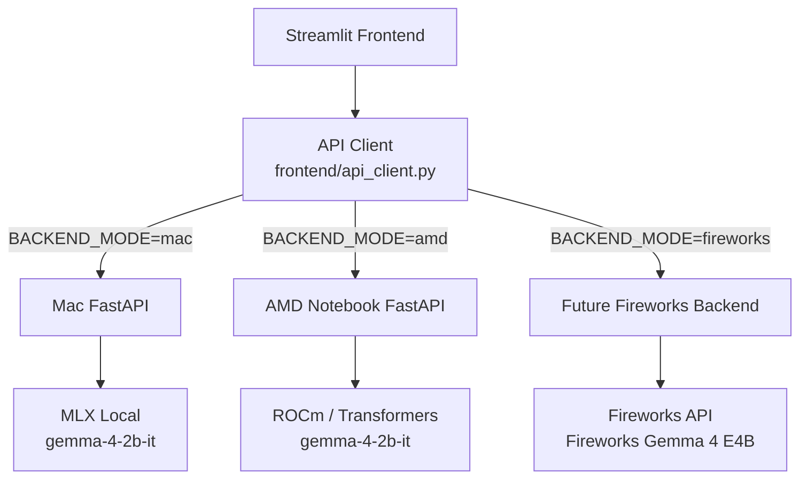

# Streamlit API Switch Architecture

This branch introduces an isolated proof-of-concept for dynamic backend routing in the Streamlit frontend. It enables swapping out the inference API target (Mac Local, AMD Notebook, or Fireworks API) using environment variables.

## Architecture Diagram



## How to Switch Backends

You can control where the frontend sends its API requests via environment variables:

1. **BACKEND_MODE**: Controls which route the `APIClient` selects. Valid options are `mac`, `amd`, and `fireworks`.
2. **URL Overrides**: Provide explicit URLs for the targets.
   - `MAC_API_URL` (default: `http://localhost:8000`)
   - `AMD_API_URL` (default: `http://localhost:8000`)
   - `FIREWORKS_API_URL` (default: `https://api.fireworks.ai`)

### Example: Running against AMD Backend

Start your backend on the AMD machine (which should expose a public or tunneled URL like `https://my-amd-tunnel.com`).

On your frontend machine, run:
```bash
export BACKEND_MODE=amd
export AMD_API_URL="https://my-amd-tunnel.com"
streamlit run frontend/streamlit_app.py
```

## API Client Features

- **Health Checks**: Implements a dedicated `/health` endpoint ping to identify the active backend provider and model loaded.
- **Resiliency**: Built-in exponential backoff for connection failures and timeouts.
- **Lazy Loading & Memory**: Handled automatically by the FastAPI/LLM layer using `@lru_cache`, keeping the model resident in VRAM for fast subsequent calls.
